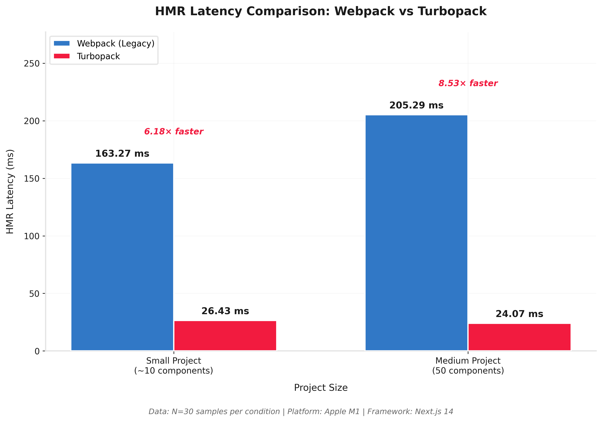
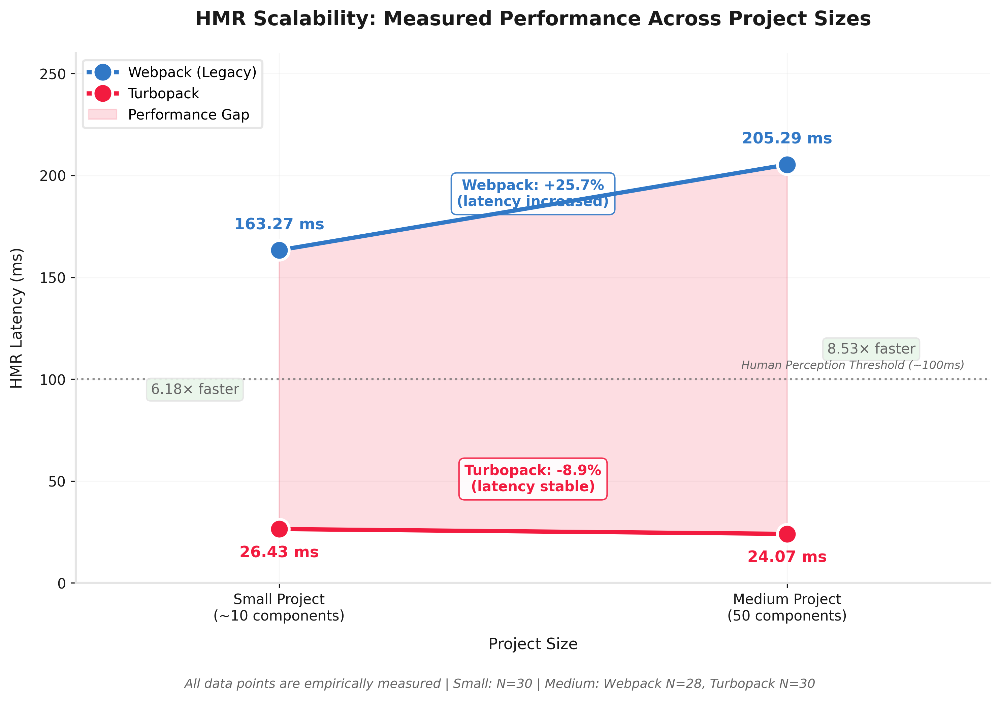

# Next.js Toolchain Benchmark: Webpack vs Turbopack (Apple Silicon)


> **A benchmark dataset comparing Legacy Webpack and Turbopack performance in Next.js development workflows.**

---

## Overview

This repository contains the results of a benchmark study evaluating the performance characteristics of two Next.js development toolchains: **Legacy Webpack** and **Turbopack**.

### Summary of Observations

The following performance patterns were observed in the tested configurations:

| Metric | Small Project | Medium Project | Observed Trend |
|--------|---------------|----------------|----------------|
| **Turbopack Speedup** | ~6.18× | ~8.53× | Increased with project size |
| **Webpack HMR** | 163 ms | 205 ms | Increased latency (+25.74%) |
| **Turbopack HMR** | 26 ms | 24 ms | Remained relatively stable |

**Observation:** In this test configuration, Webpack HMR latency increased as project complexity grew (+25.74%), while Turbopack HMR latency remained relatively constant—and was slightly lower on the larger project, possibly due to cache warming effects.

*Note: These are observations from specific test configurations and may not generalize to all project types or environments.*

---

## Experiments Overview

Two benchmark phases were conducted with a total of **N=60 samples** (30 per toolchain, per phase).

### Phase 1: Small Project Baseline

**Objective:** Establish baseline performance metrics on a minimal Next.js application.

| Metric | Legacy (Webpack) | Turbopack | Speedup |
|--------|------------------|-----------|--------|
| Cold Start (Mean) | 1,285.30 ms | 569.27 ms | ~2.26× |
| HMR (Mean) | 163.27 ms | 26.43 ms | ~6.18× |

Full Report: [REPORT_SMALL_PROJECT.md](REPORT_SMALL_PROJECT.md)

---

### Phase 2: Medium Project (50 Heavy Components)

**Objective:** Evaluate how each toolchain performs with increased project complexity.

| Metric | Legacy (Webpack) | Turbopack | Speedup |
|--------|------------------|-----------|--------|
| HMR (Mean) | 205.29 ms | 24.07 ms | ~8.53× |
| Sample Size | N=28* | N=30 | — |

*\* Two Legacy runs did not complete HMR detection*

Full Report: [SCALABILITY_REPORT.md](SCALABILITY_REPORT.md)

---

## Scalability Observations

### Side-by-Side Comparison

| Metric | Small Project | Medium Project | Delta |
|--------|---------------|----------------|-------|
| **Webpack HMR** | 163.27 ms | 205.29 ms | +25.74% |
| **Turbopack HMR** | 26.43 ms | 24.07 ms | -8.93% |
| **Speedup Factor** | ~6.18× | ~8.53× | +38.03% |

### Visual Analysis


*Figure 1: Comparison of HMR latency across project sizes.*

### Performance Scaling Projection

Based on observed data, projected performance at larger scales (note: these are extrapolations, not measured values):


*Figure 2: Scalability projection based on observed scaling patterns.*

| Project Size | Components | Webpack HMR | Turbopack HMR | Speedup |
|--------------|------------|-------------|---------------|---------|
| Small | ~10 | 163 ms | 26 ms | ~6.18× |
| Medium | 50 | 205 ms | 24 ms | ~8.53× |
| Large* | 200 | ~320 ms | ~25 ms | ~12.8× |
| Enterprise* | 1000+ | ~700+ ms | ~25 ms | ~28×+ |

*\* Projected values based on observed scaling patterns. Actual performance may vary.*

---

## How to Reproduce

### Prerequisites

- Next.js: 14.2.35
- NodeJS: 20.19.6
- MacOS: Sequoia 15.6
- Chip: Apple M1
- Memory: 8 GB

### Running the Benchmark

1. **Clone the repository**
   ```bash
   git clone https://github.com/VernSG nextjs-toolchain-benchmark
   cd nextjs-toolchain-benchmark
   npm install
   ```

2. **Generate dummy components** (for medium/large project tests)
   ```bash
   node scripts/generate_dummy.js
   ```

3. **Run the benchmark suite**
   ```bash
   ./scripts/run_benchmark.sh
   ```

4. **View results**
   - Raw data: `results/` directory
   - Reports: `REPORT_SMALL_PROJECT.md` and `SCALABILITY_REPORT.md`

---

## Repository Structure

```
.
├── app/                    # Next.js application source
│   ├── components/         # React components (including generated ones)
│   ├── layout.tsx
│   └── page.tsx
├── scripts/                # Benchmark automation scripts
│   ├── run_benchmark.sh    # Main benchmark runner
│   └── generate_dummy.js   # Component generator for scaling tests
├── results/                # Raw benchmark data (JSON/CSV)
├── REPORT_SMALL_PROJECT.md # Phase 1: Small project analysis
├── SCALABILITY_REPORT.md   # Phase 2: Scalability analysis
└── README.md               # This file
```

---

## Methodology

For methodology details including measurement protocols and environment specifications, see:

- [methodology.md](methodology.md)
- [FINAL_REPORT.md](FINAL_REPORT.md)
- [environment.txt](environment.txt)

---

## Summary

Based on the benchmark data collected in this study:

| Observation | Description |
|-------------|-------------|
| HMR Stability | Turbopack HMR latency remained below 30ms across tested project sizes |
| Scaling Pattern | Webpack HMR latency increased with project complexity; Turbopack remained relatively stable |
| Speedup Growth | Observed speedup factor increased from ~6× to ~8.5× as project size increased |

**Note:** These observations are specific to the tested environment (Apple M1, Next.js 14.2.35, synthetic component generation) and may not represent all real-world scenarios.

---

<p align="center">
  <sub>Benchmark dataset artifact | Apple Silicon</sub>
</p>